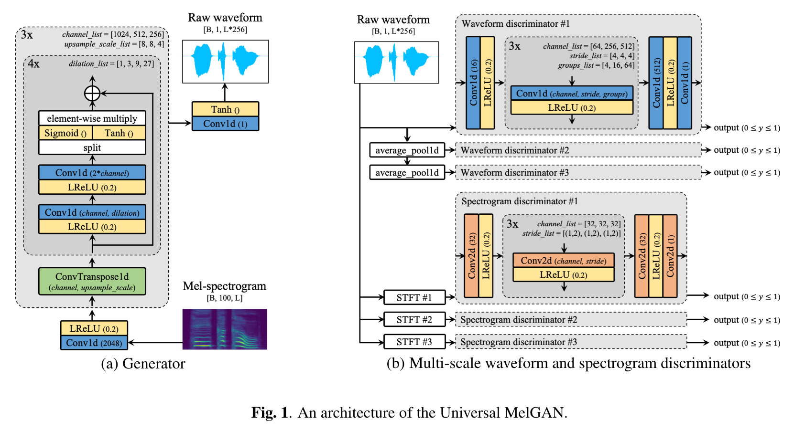

<head>
  <meta charset="UTF-8">
  <script>
    function play(path, div) {{
      cells = document.getElementsByClassName('round-button')
        for(let i=0; i<cells.length; i++) {
            console.log(cells.item(i));
            cells.item(i).style.color = "black";
        }
      div.style.color = "red";
      var player = document.getElementById('player');
      player.src = path;
      player.play();
    }}
  </script>
<link rel="stylesheet" href="https://use.fontawesome.com/releases/v5.8.2/css/all.css" integrity="sha384-oS3vJWv+0UjzBfQzYUhtDYW+Pj2yciDJxpsK1OYPAYjqT085Qq/1cq5FLXAZQ7Ay" crossorigin="anonymous">
<style>
.audio-cell {
  /* Center audio widgets in the table cell. */
  text-align: center;
  padding-bottom: 1px;
  padding-top: 1px;
}
.audio-cell-padded { 
  text-align: center;
  padding-bottom: 10px;
  padding-top: 10px;
}
.audio-header {
  text-align: left;
  /* Don't wrap header text. */
  white-space: nowrap;
  /* Some breaking space between headers for readability. */   
  padding-right: 5px; 
  padding-left: 5px; 
}
.reference-cell {
  /* For uniformity and to wrap long reference text, limit the reference cell's width. */
  width: 25%;
  padding-top: 20px;
  padding-bottom: 20px;
}
.sample audio {
  vertical-align: middle;
  padding-left: 3px;
  padding-right: 3px;
}

.round-button {
  box-sizing: border-box;
  display:block;
  width:30px;
  height:30px;
  padding-top: 8px;
  padding-left: 3px;
  line-height: 6px;
  border: 1.2px solid #000;
  border-radius: 50%;
  color: #000;
  text-align:center;
  background-color: rgba(0,0,0,0.00);
  font-size:6px;
  box-shadow: 0px 0px 2px rgba(0,0,0,1);
  transition: all 0.2s ease;
}
.round-button:hover {
  background-color: rgba(0,0,0,0.0);
  box-shadow: 0px 0px 4px rgba(0,0,0,1);
}
.round-button:active {
  background-color: rgba(0,0,0,0.01);
  box-shadow: 0px 0px 1px rgba(0,0,0,1);
}
</style>
</head>


# Table of contents
{:.no_toc}
* toc
{:toc}

# Abstract
{: width="80%"}{: .center}
In this paper, we propose Universal MelGAN: a robust waveform generation model for high-fidelity speech synthesis. The proposed model was improved as follows. 1) We increased the hidden channel sizes of the generator by 4 times and applied gated activation unit to the last layer of each residual stack. 2) To alleviate the over-smoothing problem in high frequency domain caused by the larger model size, we designed multi-resolution spectrogram discriminators and attached to the model. As a result, our model trained by hundreds of speakers recorded the best MOS score among the competing baselines in most seen and unseen domain scenarios such as speaker, language, recording condition or emotion in both Korean and English. In text-to-speech, high-fidelity audio was produced regardless of whether seen or unseen speakers(a real-time synthesis speed of 0.028 RTF on NVIDIA V100 GPU). This result obtained without any explicit domain information suggests the possibility of the proposed model as a universal vocoder.

# Korean samples

## Seen speakers scenarios

### Single speaker

### Multiple speakers

## Unseen speakers and out-of-domain scenarios

### Clean, noisy and reverberant

### Expressive

### Unseen languages

## Text-to-speech

### Large dataset

### Small dataset


# English samples

## Seen speakers scenarios

### Single speaker

### Multiple speakers

## Unseen speakers and out-of-domain scenarios

### Clean, noisy and reverberant

### Expressive

### Unseen languages

## Text-to-speech

# Additional study

## Korean TTS samples: Multi-band + AMP
(achieved 0.003 RTF on NVIDIA V100 GPU)

## Welcome to GitHub Page

You can use the [editor on GitHub](https://github.com/kallavinka8045/icassp2021/edit/gh-pages/index.md) to maintain and preview the content for your website in Markdown files.

Whenever you commit to this repository, GitHub Pages will run [Jekyll](https://jekyllrb.com/) to rebuild the pages in your site, from the content in your Markdown files.

<tr>
  <td><audio controls ><source src="wav_for_mos/eng/wavernn/eng_seen_single/LJ021-0045.wav" type="audio/wav"></audio></td>
  <td><audio controls ><source src="wav_for_mos/eng/wavernn/eng_seen_single/LJ021-0045.wav" type="audio/wav"></audio></td>
  <td><audio controls ><source src="wav_for_mos/eng/wavernn/eng_seen_single/LJ021-0045.wav" type="audio/wav"></audio></td>
  <td><audio controls ><source src="wav_for_mos/eng/wavernn/eng_seen_single/LJ021-0045.wav" type="audio/wav"></audio></td>
  <td><audio controls ><source src="wav_for_mos/eng/wavernn/eng_seen_single/LJ021-0045.wav" type="audio/wav"></audio></td>
  <td><audio controls ><source src="wav_for_mos/eng/wavernn/eng_seen_single/LJ021-0045.wav" type="audio/wav"></audio></td>
</tr>

### Markdown

Markdown is a lightweight and easy-to-use syntax for styling your writing. It includes conventions for

```markdown
Syntax highlighted code block

# Header 1
## Header 2
### Header 3

- Bulleted
- List

1. Numbered
2. List

**Bold** and _Italic_ and `Code` text

[Link](url) and 
```

For more details see [GitHub Flavored Markdown](https://guides.github.com/features/mastering-markdown/).

### Jekyll Themes

Your Pages site will use the layout and styles from the Jekyll theme you have selected in your [repository settings](https://github.com/kallavinka8045/icassp2021/settings). The name of this theme is saved in the Jekyll `_config.yml` configuration file.

### Support or Contact

Having trouble with Pages? Check out our [documentation](https://docs.github.com/categories/github-pages-basics/) or [contact support](https://github.com/contact) and we’ll help you sort it out.
