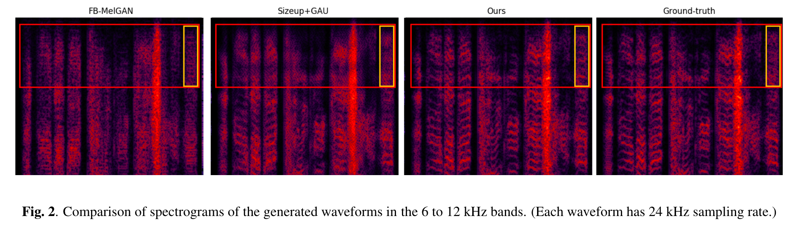

# Table of contents
{:.no_toc}
* toc
{:toc}

# Abstract
{: width="75%"}{: .center}
{: width="85%"}{: .center}
In this paper, we propose Universal MelGAN: a robust waveform generation model for high-fidelity speech synthesis. The proposed model was improved as follows. 1) We increased the hidden channel sizes of the generator by 4 times and applied gated activation unit to the last layer of each residual stack. 2) To alleviate the over-smoothing problem in high frequency domain caused by the larger model size, we designed multi-resolution spectrogram discriminators and attached to the model. As a result, our model trained by hundreds of speakers recorded the best MOS score among the competing baselines in most seen and unseen domain scenarios such as speaker, language, recording condition or emotion in both Korean and English. In text-to-speech, high-fidelity audio was produced regardless of whether seen or unseen speakers(a real-time synthesis speed of 0.028 RTF on NVIDIA V100 GPU). This result obtained without any explicit domain information suggests the possibility of the proposed model as a universal vocoder.

# Korean samples
For Korean, each model was trained on studio-quality internal datasets with 62 speakers and 265k utterance.  
'Seen' or 'in-domain' indicates that the speaker or domain has been trained.  
'Unseen' or 'out-of-domain' indicates that the speaker or domain has never been trained.

## Seen speakers scenarios

### Single speaker
<table>
    <thead>
        <th>Index</th>
        <th>Recording</th>
        <th>Universal MelGAN</th>
        <th>FB-MelGAN</th>
        <th>WaveRNN</th>
        <th>WaveGlow</th>
        <th>WaveNet</th>
    </thead>
    <tbody>
        <tr>
            <th>#1</th>
            <td><audio controls style="width: 150px;"><source src="wav_for_demo/kor/gt/kor_seen_single/FTTS_dg21445.wav" type="audio/wav"></audio></td>
            <td><audio controls style="width: 150px;"><source src="wav_for_demo/kor/melgan_ours/kor_seen_single/FTTS_dg21445.wav" type="audio/wav"></audio></td>
            <td><audio controls style="width: 150px;"><source src="wav_for_demo/kor/melgan_orig/kor_seen_single/FTTS_dg21445.wav" type="audio/wav"></audio></td>
            <td><audio controls style="width: 150px;"><source src="wav_for_demo/kor/wavernn/kor_seen_single/FTTS_dg21445.wav" type="audio/wav"></audio></td>
            <td><audio controls style="width: 150px;"><source src="wav_for_demo/kor/waveglow/kor_seen_single/FTTS_dg21445.wav" type="audio/wav"></audio></td>
            <td><audio controls style="width: 150px;"><source src="wav_for_demo/kor/wavenet/kor_seen_single/FTTS_dg21445.wav" type="audio/wav"></audio></td>
        </tr>
    </tbody>
    <tbody>
        <tr>
            <th>#2</th>
            <td><audio controls style="width: 150px;"><source src="wav_for_demo/kor/gt/kor_seen_single/FTTS_dw09691.wav" type="audio/wav"></audio></td>
            <td><audio controls style="width: 150px;"><source src="wav_for_demo/kor/melgan_ours/kor_seen_single/FTTS_dw09691.wav" type="audio/wav"></audio></td>
            <td><audio controls style="width: 150px;"><source src="wav_for_demo/kor/melgan_orig/kor_seen_single/FTTS_dw09691.wav" type="audio/wav"></audio></td>
            <td><audio controls style="width: 150px;"><source src="wav_for_demo/kor/wavernn/kor_seen_single/FTTS_dw09691.wav" type="audio/wav"></audio></td>
            <td><audio controls style="width: 150px;"><source src="wav_for_demo/kor/waveglow/kor_seen_single/FTTS_dw09691.wav" type="audio/wav"></audio></td>
            <td><audio controls style="width: 150px;"><source src="wav_for_demo/kor/wavenet/kor_seen_single/FTTS_dw09691.wav" type="audio/wav"></audio></td>
        </tr>
    </tbody>
    <tbody>
        <tr>
            <th>#3</th>
            <td><audio controls style="width: 150px;"><source src="wav_for_demo/kor/gt/kor_seen_single/FTTS_dw10439.wav" type="audio/wav"></audio></td>
            <td><audio controls style="width: 150px;"><source src="wav_for_demo/kor/melgan_ours/kor_seen_single/FTTS_dw10439.wav" type="audio/wav"></audio></td>
            <td><audio controls style="width: 150px;"><source src="wav_for_demo/kor/melgan_orig/kor_seen_single/FTTS_dw10439.wav" type="audio/wav"></audio></td>
            <td><audio controls style="width: 150px;"><source src="wav_for_demo/kor/wavernn/kor_seen_single/FTTS_dw10439.wav" type="audio/wav"></audio></td>
            <td><audio controls style="width: 150px;"><source src="wav_for_demo/kor/waveglow/kor_seen_single/FTTS_dw10439.wav" type="audio/wav"></audio></td>
            <td><audio controls style="width: 150px;"><source src="wav_for_demo/kor/wavenet/kor_seen_single/FTTS_dw10439.wav" type="audio/wav"></audio></td>
        </tr>
    </tbody>
</table>

### Multiple speakers
<table>
    <thead>
        <th>Index</th>
        <th>Recording</th>
        <th>Universal MelGAN</th>
        <th>FB-MelGAN</th>
        <th>WaveRNN</th>
        <th>WaveGlow</th>
        <th>WaveNet</th>
    </thead>
    <tbody>
        <tr>
            <th>#1</th>
            <td><audio controls style="width: 150px;"><source src="wav_for_demo/kor/gt/kor_seen_universal/F004_00077.wav" type="audio/wav"></audio></td>
            <td><audio controls style="width: 150px;"><source src="wav_for_demo/kor/melgan_ours/kor_seen_universal/F004_00077.wav" type="audio/wav"></audio></td>
            <td><audio controls style="width: 150px;"><source src="wav_for_demo/kor/melgan_orig/kor_seen_universal/F004_00077.wav" type="audio/wav"></audio></td>
            <td><audio controls style="width: 150px;"><source src="wav_for_demo/kor/wavernn/kor_seen_universal/F004_00077.wav" type="audio/wav"></audio></td>
            <td><audio controls style="width: 150px;"><source src="wav_for_demo/kor/waveglow/kor_seen_universal/F004_00077.wav" type="audio/wav"></audio></td>
            <td><audio controls style="width: 150px;"><source src="wav_for_demo/kor/wavenet/kor_seen_universal/F004_00077.wav" type="audio/wav"></audio></td>
        </tr>
    </tbody>
    <tbody>
        <tr>
            <th>#2</th>
            <td><audio controls style="width: 150px;"><source src="wav_for_demo/kor/gt/kor_seen_universal/F006_00501.wav" type="audio/wav"></audio></td>
            <td><audio controls style="width: 150px;"><source src="wav_for_demo/kor/melgan_ours/kor_seen_universal/F006_00501.wav" type="audio/wav"></audio></td>
            <td><audio controls style="width: 150px;"><source src="wav_for_demo/kor/melgan_orig/kor_seen_universal/F006_00501.wav" type="audio/wav"></audio></td>
            <td><audio controls style="width: 150px;"><source src="wav_for_demo/kor/wavernn/kor_seen_universal/F006_00501.wav" type="audio/wav"></audio></td>
            <td><audio controls style="width: 150px;"><source src="wav_for_demo/kor/waveglow/kor_seen_universal/F006_00501.wav" type="audio/wav"></audio></td>
            <td><audio controls style="width: 150px;"><source src="wav_for_demo/kor/wavenet/kor_seen_universal/F006_00501.wav" type="audio/wav"></audio></td>
        </tr>
    </tbody>
    <tbody>
        <tr>
            <th>#3</th>
            <td><audio controls style="width: 150px;"><source src="wav_for_demo/kor/gt/kor_seen_universal/M008_00968.wav" type="audio/wav"></audio></td>
            <td><audio controls style="width: 150px;"><source src="wav_for_demo/kor/melgan_ours/kor_seen_universal/M008_00968.wav" type="audio/wav"></audio></td>
            <td><audio controls style="width: 150px;"><source src="wav_for_demo/kor/melgan_orig/kor_seen_universal/M008_00968.wav" type="audio/wav"></audio></td>
            <td><audio controls style="width: 150px;"><source src="wav_for_demo/kor/wavernn/kor_seen_universal/M008_00968.wav" type="audio/wav"></audio></td>
            <td><audio controls style="width: 150px;"><source src="wav_for_demo/kor/waveglow/kor_seen_universal/M008_00968.wav" type="audio/wav"></audio></td>
            <td><audio controls style="width: 150px;"><source src="wav_for_demo/kor/wavenet/kor_seen_universal/M008_00968.wav" type="audio/wav"></audio></td>
        </tr>
    </tbody>
</table>

## Unseen speakers and out-of-domain scenarios

### Clean, noisy and reverberant
<table>
    <thead>
        <th>Index</th>
        <th>Recording</th>
        <th>Universal MelGAN</th>
        <th>FB-MelGAN</th>
        <th>WaveRNN</th>
        <th>WaveGlow</th>
        <th>WaveNet</th>
    </thead>
    <tbody>
        <tr>
            <th>Clean #1</th>
            <td><audio controls style="width: 150px;"><source src="wav_for_demo/kor/gt/kor_ood_unseen_clean/F003_00117.wav" type="audio/wav"></audio></td>
            <td><audio controls style="width: 150px;"><source src="wav_for_demo/kor/melgan_ours/kor_ood_unseen_clean/F003_00117.wav" type="audio/wav"></audio></td>
            <td><audio controls style="width: 150px;"><source src="wav_for_demo/kor/melgan_orig/kor_ood_unseen_clean/F003_00117.wav" type="audio/wav"></audio></td>
            <td><audio controls style="width: 150px;"><source src="wav_for_demo/kor/wavernn/kor_ood_unseen_clean/F003_00117.wav" type="audio/wav"></audio></td>
            <td><audio controls style="width: 150px;"><source src="wav_for_demo/kor/waveglow/kor_ood_unseen_clean/F003_00117.wav" type="audio/wav"></audio></td>
            <td><audio controls style="width: 150px;"><source src="wav_for_demo/kor/wavenet/kor_ood_unseen_clean/F003_00117.wav" type="audio/wav"></audio></td>
        </tr>
    </tbody>
    <tbody>
        <tr>
            <th>Clean #2</th>
            <td><audio controls style="width: 150px;"><source src="wav_for_demo/kor/gt/kor_ood_unseen_clean/M007_01000.wav" type="audio/wav"></audio></td>
            <td><audio controls style="width: 150px;"><source src="wav_for_demo/kor/melgan_ours/kor_ood_unseen_clean/M007_01000.wav" type="audio/wav"></audio></td>
            <td><audio controls style="width: 150px;"><source src="wav_for_demo/kor/melgan_orig/kor_ood_unseen_clean/M007_01000.wav" type="audio/wav"></audio></td>
            <td><audio controls style="width: 150px;"><source src="wav_for_demo/kor/wavernn/kor_ood_unseen_clean/M007_01000.wav" type="audio/wav"></audio></td>
            <td><audio controls style="width: 150px;"><source src="wav_for_demo/kor/waveglow/kor_ood_unseen_clean/M007_01000.wav" type="audio/wav"></audio></td>
            <td><audio controls style="width: 150px;"><source src="wav_for_demo/kor/wavenet/kor_ood_unseen_clean/M007_01000.wav" type="audio/wav"></audio></td>
        </tr>
    </tbody>
        <tbody>
        <tr>
            <th>Noisy #1</th>
            <td><audio controls style="width: 150px;"><source src="wav_for_demo/kor/gt/kor_ood_noisy/F003_00117.wav" type="audio/wav"></audio></td>
            <td><audio controls style="width: 150px;"><source src="wav_for_demo/kor/melgan_ours/kor_ood_noisy/F003_00117.wav" type="audio/wav"></audio></td>
            <td><audio controls style="width: 150px;"><source src="wav_for_demo/kor/melgan_orig/kor_ood_noisy/F003_00117.wav" type="audio/wav"></audio></td>
            <td><audio controls style="width: 150px;"><source src="wav_for_demo/kor/wavernn/kor_ood_noisy/F003_00117.wav" type="audio/wav"></audio></td>
            <td><audio controls style="width: 150px;"><source src="wav_for_demo/kor/waveglow/kor_ood_noisy/F003_00117.wav" type="audio/wav"></audio></td>
            <td><audio controls style="width: 150px;"><source src="wav_for_demo/kor/wavenet/kor_ood_noisy/F003_00117.wav" type="audio/wav"></audio></td>
        </tr>
    </tbody>
    <tbody>
        <tr>
            <th>Noisy #2</th>
            <td><audio controls style="width: 150px;"><source src="wav_for_demo/kor/gt/kor_ood_noisy/M007_01000.wav" type="audio/wav"></audio></td>
            <td><audio controls style="width: 150px;"><source src="wav_for_demo/kor/melgan_ours/kor_ood_noisy/M007_01000.wav" type="audio/wav"></audio></td>
            <td><audio controls style="width: 150px;"><source src="wav_for_demo/kor/melgan_orig/kor_ood_noisy/M007_01000.wav" type="audio/wav"></audio></td>
            <td><audio controls style="width: 150px;"><source src="wav_for_demo/kor/wavernn/kor_ood_noisy/M007_01000.wav" type="audio/wav"></audio></td>
            <td><audio controls style="width: 150px;"><source src="wav_for_demo/kor/waveglow/kor_ood_noisy/M007_01000.wav" type="audio/wav"></audio></td>
            <td><audio controls style="width: 150px;"><source src="wav_for_demo/kor/wavenet/kor_ood_noisy/M007_01000.wav" type="audio/wav"></audio></td>
        </tr>
    </tbody>
        <tbody>
        <tr>
            <th>Reverb #1</th>
            <td><audio controls style="width: 150px;"><source src="wav_for_demo/kor/gt/kor_ood_reverberated/F003_00117.wav" type="audio/wav"></audio></td>
            <td><audio controls style="width: 150px;"><source src="wav_for_demo/kor/melgan_ours/kor_ood_reverberated/F003_00117.wav" type="audio/wav"></audio></td>
            <td><audio controls style="width: 150px;"><source src="wav_for_demo/kor/melgan_orig/kor_ood_reverberated/F003_00117.wav" type="audio/wav"></audio></td>
            <td><audio controls style="width: 150px;"><source src="wav_for_demo/kor/wavernn/kor_ood_reverberated/F003_00117.wav" type="audio/wav"></audio></td>
            <td><audio controls style="width: 150px;"><source src="wav_for_demo/kor/waveglow/kor_ood_reverberated/F003_00117.wav" type="audio/wav"></audio></td>
            <td><audio controls style="width: 150px;"><source src="wav_for_demo/kor/wavenet/kor_ood_reverberated/F003_00117.wav" type="audio/wav"></audio></td>
        </tr>
    </tbody>
    <tbody>
        <tr>
            <th>Reverb #2</th>
            <td><audio controls style="width: 150px;"><source src="wav_for_demo/kor/gt/kor_ood_reverberated/M007_01000.wav" type="audio/wav"></audio></td>
            <td><audio controls style="width: 150px;"><source src="wav_for_demo/kor/melgan_ours/kor_ood_reverberated/M007_01000.wav" type="audio/wav"></audio></td>
            <td><audio controls style="width: 150px;"><source src="wav_for_demo/kor/melgan_orig/kor_ood_reverberated/M007_01000.wav" type="audio/wav"></audio></td>
            <td><audio controls style="width: 150px;"><source src="wav_for_demo/kor/wavernn/kor_ood_reverberated/M007_01000.wav" type="audio/wav"></audio></td>
            <td><audio controls style="width: 150px;"><source src="wav_for_demo/kor/waveglow/kor_ood_reverberated/M007_01000.wav" type="audio/wav"></audio></td>
            <td><audio controls style="width: 150px;"><source src="wav_for_demo/kor/wavenet/kor_ood_reverberated/M007_01000.wav" type="audio/wav"></audio></td>
        </tr>
    </tbody>
</table>

### Expressive
<table>
    <thead>
        <th>Index</th>
        <th>Recording</th>
        <th>Universal MelGAN</th>
        <th>FB-MelGAN</th>
        <th>WaveRNN</th>
        <th>WaveGlow</th>
        <th>WaveNet</th>
    </thead>
    <tbody>
        <tr>
            <th>Sportscasting</th>
            <td><audio controls style="width: 150px;"><source src="wav_for_demo/kor/gt/kor_ood_expressive/EK_00006.wav" type="audio/wav"></audio></td>
            <td><audio controls style="width: 150px;"><source src="wav_for_demo/kor/melgan_ours/kor_ood_expressive/EK_00006.wav" type="audio/wav"></audio></td>
            <td><audio controls style="width: 150px;"><source src="wav_for_demo/kor/melgan_orig/kor_ood_expressive/EK_00006.wav" type="audio/wav"></audio></td>
            <td><audio controls style="width: 150px;"><source src="wav_for_demo/kor/wavernn/kor_ood_expressive/EK_00006.wav" type="audio/wav"></audio></td>
            <td><audio controls style="width: 150px;"><source src="wav_for_demo/kor/waveglow/kor_ood_expressive/EK_00006.wav" type="audio/wav"></audio></td>
            <td><audio controls style="width: 150px;"><source src="wav_for_demo/kor/wavenet/kor_ood_expressive/EK_00006.wav" type="audio/wav"></audio></td>
        </tr>
    </tbody>
    <tbody>
        <tr>
            <th>Anger</th>
            <td><audio controls style="width: 150px;"><source src="wav_for_demo/kor/gt/kor_ood_expressive/acriil_ang_00002100.wav" type="audio/wav"></audio></td>
            <td><audio controls style="width: 150px;"><source src="wav_for_demo/kor/melgan_ours/kor_ood_expressive/acriil_ang_00002100.wav" type="audio/wav"></audio></td>
            <td><audio controls style="width: 150px;"><source src="wav_for_demo/kor/melgan_orig/kor_ood_expressive/acriil_ang_00002100.wav" type="audio/wav"></audio></td>
            <td><audio controls style="width: 150px;"><source src="wav_for_demo/kor/wavernn/kor_ood_expressive/acriil_ang_00002100.wav" type="audio/wav"></audio></td>
            <td><audio controls style="width: 150px;"><source src="wav_for_demo/kor/waveglow/kor_ood_expressive/acriil_ang_00002100.wav" type="audio/wav"></audio></td>
            <td><audio controls style="width: 150px;"><source src="wav_for_demo/kor/wavenet/kor_ood_expressive/acriil_ang_00002100.wav" type="audio/wav"></audio></td>
        </tr>
    </tbody>
    <tbody>
        <tr>
            <th>Disgust</th>
            <td><audio controls style="width: 150px;"><source src="wav_for_demo/kor/gt/kor_ood_expressive/acriil_dis_00001215.wav" type="audio/wav"></audio></td>
            <td><audio controls style="width: 150px;"><source src="wav_for_demo/kor/melgan_ours/kor_ood_expressive/acriil_dis_00001215.wav" type="audio/wav"></audio></td>
            <td><audio controls style="width: 150px;"><source src="wav_for_demo/kor/melgan_orig/kor_ood_expressive/acriil_dis_00001215.wav" type="audio/wav"></audio></td>
            <td><audio controls style="width: 150px;"><source src="wav_for_demo/kor/wavernn/kor_ood_expressive/acriil_dis_00001215.wav" type="audio/wav"></audio></td>
            <td><audio controls style="width: 150px;"><source src="wav_for_demo/kor/waveglow/kor_ood_expressive/acriil_dis_00001215.wav" type="audio/wav"></audio></td>
            <td><audio controls style="width: 150px;"><source src="wav_for_demo/kor/wavenet/kor_ood_expressive/acriil_dis_00001215.wav" type="audio/wav"></audio></td>
        </tr>
    </tbody>
    <tbody>
        <tr>
            <th>Fear</th>
            <td><audio controls style="width: 150px;"><source src="wav_for_demo/kor/gt/kor_ood_expressive/acriil_fea_00002020.wav" type="audio/wav"></audio></td>
            <td><audio controls style="width: 150px;"><source src="wav_for_demo/kor/melgan_ours/kor_ood_expressive/acriil_fea_00002020.wav" type="audio/wav"></audio></td>
            <td><audio controls style="width: 150px;"><source src="wav_for_demo/kor/melgan_orig/kor_ood_expressive/acriil_fea_00002020.wav" type="audio/wav"></audio></td>
            <td><audio controls style="width: 150px;"><source src="wav_for_demo/kor/wavernn/kor_ood_expressive/acriil_fea_00002020.wav" type="audio/wav"></audio></td>
            <td><audio controls style="width: 150px;"><source src="wav_for_demo/kor/waveglow/kor_ood_expressive/acriil_fea_00002020.wav" type="audio/wav"></audio></td>
            <td><audio controls style="width: 150px;"><source src="wav_for_demo/kor/wavenet/kor_ood_expressive/acriil_fea_00002020.wav" type="audio/wav"></audio></td>
        </tr>
    </tbody>
    <tbody>
        <tr>
            <th>Happiness</th>
            <td><audio controls style="width: 150px;"><source src="wav_for_demo/kor/gt/kor_ood_expressive/acriil_hap_00002002.wav" type="audio/wav"></audio></td>
            <td><audio controls style="width: 150px;"><source src="wav_for_demo/kor/melgan_ours/kor_ood_expressive/acriil_hap_00002002.wav" type="audio/wav"></audio></td>
            <td><audio controls style="width: 150px;"><source src="wav_for_demo/kor/melgan_orig/kor_ood_expressive/acriil_hap_00002002.wav" type="audio/wav"></audio></td>
            <td><audio controls style="width: 150px;"><source src="wav_for_demo/kor/wavernn/kor_ood_expressive/acriil_hap_00002002.wav" type="audio/wav"></audio></td>
            <td><audio controls style="width: 150px;"><source src="wav_for_demo/kor/waveglow/kor_ood_expressive/acriil_hap_00002002.wav" type="audio/wav"></audio></td>
            <td><audio controls style="width: 150px;"><source src="wav_for_demo/kor/wavenet/kor_ood_expressive/acriil_hap_00002002.wav" type="audio/wav"></audio></td>
        </tr>
    </tbody>
    <tbody>
        <tr>
            <th>Sadness</th>
            <td><audio controls style="width: 150px;"><source src="wav_for_demo/kor/gt/kor_ood_expressive/acriil_sad_00000027.wav" type="audio/wav"></audio></td>
            <td><audio controls style="width: 150px;"><source src="wav_for_demo/kor/melgan_ours/kor_ood_expressive/acriil_sad_00000027.wav" type="audio/wav"></audio></td>
            <td><audio controls style="width: 150px;"><source src="wav_for_demo/kor/melgan_orig/kor_ood_expressive/acriil_sad_00000027.wav" type="audio/wav"></audio></td>
            <td><audio controls style="width: 150px;"><source src="wav_for_demo/kor/wavernn/kor_ood_expressive/acriil_sad_00000027.wav" type="audio/wav"></audio></td>
            <td><audio controls style="width: 150px;"><source src="wav_for_demo/kor/waveglow/kor_ood_expressive/acriil_sad_00000027.wav" type="audio/wav"></audio></td>
            <td><audio controls style="width: 150px;"><source src="wav_for_demo/kor/wavenet/kor_ood_expressive/acriil_sad_00000027.wav" type="audio/wav"></audio></td>
        </tr>
    </tbody>
</table>

### Unseen languages
<table>
    <thead>
        <th>Index</th>
        <th>Recording</th>
        <th>Universal MelGAN</th>
        <th>FB-MelGAN</th>
        <th>WaveRNN</th>
        <th>WaveGlow</th>
        <th>WaveNet</th>
    </thead>
    <tbody>
        <tr>
            <th>Spanish</th>
            <td><audio controls style="width: 150px;"><source src="wav_for_demo/kor/gt/kor_ood_unseen_languages/bailen_0033.wav" type="audio/wav"></audio></td>
            <td><audio controls style="width: 150px;"><source src="wav_for_demo/kor/melgan_ours/kor_ood_unseen_languages/bailen_0033.wav" type="audio/wav"></audio></td>
            <td><audio controls style="width: 150px;"><source src="wav_for_demo/kor/melgan_orig/kor_ood_unseen_languages/bailen_0033.wav" type="audio/wav"></audio></td>
            <td><audio controls style="width: 150px;"><source src="wav_for_demo/kor/wavernn/kor_ood_unseen_languages/bailen_0033.wav" type="audio/wav"></audio></td>
            <td><audio controls style="width: 150px;"><source src="wav_for_demo/kor/waveglow/kor_ood_unseen_languages/bailen_0033.wav" type="audio/wav"></audio></td>
            <td><audio controls style="width: 150px;"><source src="wav_for_demo/kor/wavenet/kor_ood_unseen_languages/bailen_0033.wav" type="audio/wav"></audio></td>
        </tr>
    </tbody>
    <tbody>
        <tr>
            <th>German</th>
            <td><audio controls style="width: 150px;"><source src="wav_for_demo/kor/gt/kor_ood_unseen_languages/meisterfloh_0657.wav" type="audio/wav"></audio></td>
            <td><audio controls style="width: 150px;"><source src="wav_for_demo/kor/melgan_ours/kor_ood_unseen_languages/meisterfloh_0657.wav" type="audio/wav"></audio></td>
            <td><audio controls style="width: 150px;"><source src="wav_for_demo/kor/melgan_orig/kor_ood_unseen_languages/meisterfloh_0657.wav" type="audio/wav"></audio></td>
            <td><audio controls style="width: 150px;"><source src="wav_for_demo/kor/wavernn/kor_ood_unseen_languages/meisterfloh_0657.wav" type="audio/wav"></audio></td>
            <td><audio controls style="width: 150px;"><source src="wav_for_demo/kor/waveglow/kor_ood_unseen_languages/meisterfloh_0657.wav" type="audio/wav"></audio></td>
            <td><audio controls style="width: 150px;"><source src="wav_for_demo/kor/wavenet/kor_ood_unseen_languages/meisterfloh_0657.wav" type="audio/wav"></audio></td>
        </tr>
    </tbody>
    <tbody>
        <tr>
            <th>French</th>
            <td><audio controls style="width: 150px;"><source src="wav_for_demo/kor/gt/kor_ood_unseen_languages/lesmis_0204.wav" type="audio/wav"></audio></td>
            <td><audio controls style="width: 150px;"><source src="wav_for_demo/kor/melgan_ours/kor_ood_unseen_languages/lesmis_0204.wav" type="audio/wav"></audio></td>
            <td><audio controls style="width: 150px;"><source src="wav_for_demo/kor/melgan_orig/kor_ood_unseen_languages/lesmis_0204.wav" type="audio/wav"></audio></td>
            <td><audio controls style="width: 150px;"><source src="wav_for_demo/kor/wavernn/kor_ood_unseen_languages/lesmis_0204.wav" type="audio/wav"></audio></td>
            <td><audio controls style="width: 150px;"><source src="wav_for_demo/kor/waveglow/kor_ood_unseen_languages/lesmis_0204.wav" type="audio/wav"></audio></td>
            <td><audio controls style="width: 150px;"><source src="wav_for_demo/kor/wavenet/kor_ood_unseen_languages/lesmis_0204.wav" type="audio/wav"></audio></td>
        </tr>
    </tbody>
    <tbody>
        <tr>
            <th>Japanese</th>
            <td><audio controls style="width: 150px;"><source src="wav_for_demo/kor/gt/kor_ood_unseen_languages/meian_6532.wav" type="audio/wav"></audio></td>
            <td><audio controls style="width: 150px;"><source src="wav_for_demo/kor/melgan_ours/kor_ood_unseen_languages/meian_6532.wav" type="audio/wav"></audio></td>
            <td><audio controls style="width: 150px;"><source src="wav_for_demo/kor/melgan_orig/kor_ood_unseen_languages/meian_6532.wav" type="audio/wav"></audio></td>
            <td><audio controls style="width: 150px;"><source src="wav_for_demo/kor/wavernn/kor_ood_unseen_languages/meian_6532.wav" type="audio/wav"></audio></td>
            <td><audio controls style="width: 150px;"><source src="wav_for_demo/kor/waveglow/kor_ood_unseen_languages/meian_6532.wav" type="audio/wav"></audio></td>
            <td><audio controls style="width: 150px;"><source src="wav_for_demo/kor/wavenet/kor_ood_unseen_languages/meian_6532.wav" type="audio/wav"></audio></td>
        </tr>
    </tbody>
    <tbody>
        <tr>
            <th>Chinese</th>
            <td><audio controls style="width: 150px;"><source src="wav_for_demo/kor/gt/kor_ood_unseen_languages/call_to_arms_0684.wav" type="audio/wav"></audio></td>
            <td><audio controls style="width: 150px;"><source src="wav_for_demo/kor/melgan_ours/kor_ood_unseen_languages/call_to_arms_0684.wav" type="audio/wav"></audio></td>
            <td><audio controls style="width: 150px;"><source src="wav_for_demo/kor/melgan_orig/kor_ood_unseen_languages/call_to_arms_0684.wav" type="audio/wav"></audio></td>
            <td><audio controls style="width: 150px;"><source src="wav_for_demo/kor/wavernn/kor_ood_unseen_languages/call_to_arms_0684.wav" type="audio/wav"></audio></td>
            <td><audio controls style="width: 150px;"><source src="wav_for_demo/kor/waveglow/kor_ood_unseen_languages/call_to_arms_0684.wav" type="audio/wav"></audio></td>
            <td><audio controls style="width: 150px;"><source src="wav_for_demo/kor/wavenet/kor_ood_unseen_languages/call_to_arms_0684.wav" type="audio/wav"></audio></td>
        </tr>
    </tbody>
</table>

## Multi-speaker text-to-speech
To evaluate this scenario, we trained the [JDI-T](https://arxiv.org/abs/2005.07799) acoustic model with duration, pitch and energy predictor.  
Each trained vocoder was fine-tuned by 100k steps using the ground-truth waveform of the 'Large' set and the mel-spectrogram generated using the text, duration, pitch and energy of the ground-truth.

### Seen speakers with large set of training data(more than 30k utterances)
<table>
    <thead>
        <th>Index</th>
        <th>Universal MelGAN</th>
        <th>FB-MelGAN</th>
        <th>WaveRNN</th>
        <th>WaveGlow</th>
        <th>WaveNet</th>
    </thead>
    <tbody>
        <tr>
            <th>#1</th>
            <td><audio controls style="width: 150px;"><source src="wav_for_demo/kor/melgan_ours/kor_tts_large/11_spring.wav" type="audio/wav"></audio></td>
            <td><audio controls style="width: 150px;"><source src="wav_for_demo/kor/melgan_orig/kor_tts_large/11_spring.wav" type="audio/wav"></audio></td>
            <td><audio controls style="width: 150px;"><source src="wav_for_demo/kor/wavernn/kor_tts_large/11_spring.wav" type="audio/wav"></audio></td>
            <td><audio controls style="width: 150px;"><source src="wav_for_demo/kor/waveglow/kor_tts_large/11_spring.wav" type="audio/wav"></audio></td>
            <td><audio controls style="width: 150px;"><source src="wav_for_demo/kor/wavenet/kor_tts_large/11_spring.wav" type="audio/wav"></audio></td>
        </tr>
    </tbody>
    <tbody>
        <tr>
            <th>#2</th>
            <td><audio controls style="width: 150px;"><source src="wav_for_demo/kor/melgan_ours/kor_tts_large/9_ryan.wav" type="audio/wav"></audio></td>
            <td><audio controls style="width: 150px;"><source src="wav_for_demo/kor/melgan_orig/kor_tts_large/9_ryan.wav" type="audio/wav"></audio></td>
            <td><audio controls style="width: 150px;"><source src="wav_for_demo/kor/wavernn/kor_tts_large/9_ryan.wav" type="audio/wav"></audio></td>
            <td><audio controls style="width: 150px;"><source src="wav_for_demo/kor/waveglow/kor_tts_large/9_ryan.wav" type="audio/wav"></audio></td>
            <td><audio controls style="width: 150px;"><source src="wav_for_demo/kor/wavenet/kor_tts_large/9_ryan.wav" type="audio/wav"></audio></td>
        </tr>
    </tbody>
    <tbody>
        <tr>
            <th>#3</th>
            <td><audio controls style="width: 150px;"><source src="wav_for_demo/kor/melgan_ours/kor_tts_large/6_naomi.wav" type="audio/wav"></audio></td>
            <td><audio controls style="width: 150px;"><source src="wav_for_demo/kor/melgan_orig/kor_tts_large/6_naomi.wav" type="audio/wav"></audio></td>
            <td><audio controls style="width: 150px;"><source src="wav_for_demo/kor/wavernn/kor_tts_large/6_naomi.wav" type="audio/wav"></audio></td>
            <td><audio controls style="width: 150px;"><source src="wav_for_demo/kor/waveglow/kor_tts_large/6_naomi.wav" type="audio/wav"></audio></td>
            <td><audio controls style="width: 150px;"><source src="wav_for_demo/kor/wavenet/kor_tts_large/6_naomi.wav" type="audio/wav"></audio></td>
        </tr>
    </tbody>
</table>

### Seen speakers with small set of training data(about 1000 utterances)
<table>
    <thead>
        <th>Index</th>
        <th>Universal MelGAN</th>
        <th>FB-MelGAN</th>
        <th>WaveRNN</th>
        <th>WaveGlow</th>
        <th>WaveNet</th>
    </thead>
    <tbody>
        <tr>
            <th>#1</th>
            <td><audio controls style="width: 150px;"><source src="wav_for_demo/kor/melgan_ours/kor_tts_small/11_alice.wav" type="audio/wav"></audio></td>
            <td><audio controls style="width: 150px;"><source src="wav_for_demo/kor/melgan_orig/kor_tts_small/11_alice.wav" type="audio/wav"></audio></td>
            <td><audio controls style="width: 150px;"><source src="wav_for_demo/kor/wavernn/kor_tts_small/11_alice.wav" type="audio/wav"></audio></td>
            <td><audio controls style="width: 150px;"><source src="wav_for_demo/kor/waveglow/kor_tts_small/11_alice.wav" type="audio/wav"></audio></td>
            <td><audio controls style="width: 150px;"><source src="wav_for_demo/kor/wavenet/kor_tts_small/11_alice.wav" type="audio/wav"></audio></td>
        </tr>
    </tbody>
    <tbody>
        <tr>
            <th>#2</th>
            <td><audio controls style="width: 150px;"><source src="wav_for_demo/kor/melgan_ours/kor_tts_small/11_bella.wav" type="audio/wav"></audio></td>
            <td><audio controls style="width: 150px;"><source src="wav_for_demo/kor/melgan_orig/kor_tts_small/11_bella.wav" type="audio/wav"></audio></td>
            <td><audio controls style="width: 150px;"><source src="wav_for_demo/kor/wavernn/kor_tts_small/11_bella.wav" type="audio/wav"></audio></td>
            <td><audio controls style="width: 150px;"><source src="wav_for_demo/kor/waveglow/kor_tts_small/11_bella.wav" type="audio/wav"></audio></td>
            <td><audio controls style="width: 150px;"><source src="wav_for_demo/kor/wavenet/kor_tts_small/11_bella.wav" type="audio/wav"></audio></td>
        </tr>
    </tbody>
    <tbody>
        <tr>
            <th>#3</th>
            <td><audio controls style="width: 150px;"><source src="wav_for_demo/kor/melgan_ours/kor_tts_small/6_bentley.wav" type="audio/wav"></audio></td>
            <td><audio controls style="width: 150px;"><source src="wav_for_demo/kor/melgan_orig/kor_tts_small/6_bentley.wav" type="audio/wav"></audio></td>
            <td><audio controls style="width: 150px;"><source src="wav_for_demo/kor/wavernn/kor_tts_small/6_bentley.wav" type="audio/wav"></audio></td>
            <td><audio controls style="width: 150px;"><source src="wav_for_demo/kor/waveglow/kor_tts_small/6_bentley.wav" type="audio/wav"></audio></td>
            <td><audio controls style="width: 150px;"><source src="wav_for_demo/kor/wavenet/kor_tts_small/6_bentley.wav" type="audio/wav"></audio></td>
        </tr>
    </tbody>
</table>

### Unseen speakers
<table>
    <thead>
        <th>Index</th>
        <th>Universal MelGAN</th>
        <th>FB-MelGAN</th>
        <th>WaveRNN</th>
        <th>WaveGlow</th>
        <th>WaveNet</th>
    </thead>
    <tbody>
        <tr>
            <th>#1</th>
            <td><audio controls style="width: 150px;"><source src="wav_for_demo/kor/melgan_ours/kor_tts_small/11_aaron.wav" type="audio/wav"></audio></td>
            <td><audio controls style="width: 150px;"><source src="wav_for_demo/kor/melgan_orig/kor_tts_small/11_aaron.wav" type="audio/wav"></audio></td>
            <td><audio controls style="width: 150px;"><source src="wav_for_demo/kor/wavernn/kor_tts_small/11_aaron.wav" type="audio/wav"></audio></td>
            <td><audio controls style="width: 150px;"><source src="wav_for_demo/kor/waveglow/kor_tts_small/11_aaron.wav" type="audio/wav"></audio></td>
            <td><audio controls style="width: 150px;"><source src="wav_for_demo/kor/wavenet/kor_tts_small/11_aaron.wav" type="audio/wav"></audio></td>
        </tr>
    </tbody>
    <tbody>
        <tr>
            <th>#2</th>
            <td><audio controls style="width: 150px;"><source src="wav_for_demo/kor/melgan_ours/kor_tts_small/6_anna.wav" type="audio/wav"></audio></td>
            <td><audio controls style="width: 150px;"><source src="wav_for_demo/kor/melgan_orig/kor_tts_small/6_anna.wav" type="audio/wav"></audio></td>
            <td><audio controls style="width: 150px;"><source src="wav_for_demo/kor/wavernn/kor_tts_small/6_anna.wav" type="audio/wav"></audio></td>
            <td><audio controls style="width: 150px;"><source src="wav_for_demo/kor/waveglow/kor_tts_small/6_anna.wav" type="audio/wav"></audio></td>
            <td><audio controls style="width: 150px;"><source src="wav_for_demo/kor/wavenet/kor_tts_small/6_anna.wav" type="audio/wav"></audio></td>
        </tr>
    </tbody>
</table>

# English samples
For English, each model was trained on [LJSpeech](https://keithito.com/LJ-Speech-Dataset/) and [LibriTTS](https://openslr.org/60/) datasets with 905 speakers and 129k utterances.  
'Seen' or 'in-domain' indicates that the speaker or domain has been trained.  
'Unseen' or 'out-of-domain' indicates that the speaker or domain has never been trained.

## Seen speakers scenarios

### Single speaker
<table>
    <thead>
        <th>Index</th>
        <th>Recording</th>
        <th>Universal MelGAN</th>
        <th>FB-MelGAN</th>
        <th>WaveRNN</th>
        <th>WaveGlow</th>
        <th>WaveNet</th>
    </thead>
    <tbody>
        <tr>
            <th>#1</th>
            <td><audio controls style="width: 150px;"><source src="wav_for_demo/eng/gt/eng_seen_single/LJ001-0029.wav" type="audio/wav"></audio></td>
            <td><audio controls style="width: 150px;"><source src="wav_for_demo/eng/melgan_ours/eng_seen_single/LJ001-0029.wav" type="audio/wav"></audio></td>
            <td><audio controls style="width: 150px;"><source src="wav_for_demo/eng/melgan_orig/eng_seen_single/LJ001-0029.wav" type="audio/wav"></audio></td>
            <td><audio controls style="width: 150px;"><source src="wav_for_demo/eng/wavernn/eng_seen_single/LJ001-0029.wav" type="audio/wav"></audio></td>
            <td><audio controls style="width: 150px;"><source src="wav_for_demo/eng/waveglow/eng_seen_single/LJ001-0029.wav" type="audio/wav"></audio></td>
            <td><audio controls style="width: 150px;"><source src="wav_for_demo/eng/wavenet/eng_seen_single/LJ001-0029.wav" type="audio/wav"></audio></td>
        </tr>
    </tbody>
    <tbody>
        <tr>
            <th>#2</th>
            <td><audio controls style="width: 150px;"><source src="wav_for_demo/eng/gt/eng_seen_single/LJ028-0505.wav" type="audio/wav"></audio></td>
            <td><audio controls style="width: 150px;"><source src="wav_for_demo/eng/melgan_ours/eng_seen_single/LJ028-0505.wav" type="audio/wav"></audio></td>
            <td><audio controls style="width: 150px;"><source src="wav_for_demo/eng/melgan_orig/eng_seen_single/LJ028-0505.wav" type="audio/wav"></audio></td>
            <td><audio controls style="width: 150px;"><source src="wav_for_demo/eng/wavernn/eng_seen_single/LJ028-0505.wav" type="audio/wav"></audio></td>
            <td><audio controls style="width: 150px;"><source src="wav_for_demo/eng/waveglow/eng_seen_single/LJ028-0505.wav" type="audio/wav"></audio></td>
            <td><audio controls style="width: 150px;"><source src="wav_for_demo/eng/wavenet/eng_seen_single/LJ028-0505.wav" type="audio/wav"></audio></td>
        </tr>
    </tbody>
    <tbody>
        <tr>
            <th>#3</th>
            <td><audio controls style="width: 150px;"><source src="wav_for_demo/eng/gt/eng_seen_single/LJ050-0083.wav" type="audio/wav"></audio></td>
            <td><audio controls style="width: 150px;"><source src="wav_for_demo/eng/melgan_ours/eng_seen_single/LJ050-0083.wav" type="audio/wav"></audio></td>
            <td><audio controls style="width: 150px;"><source src="wav_for_demo/eng/melgan_orig/eng_seen_single/LJ050-0083.wav" type="audio/wav"></audio></td>
            <td><audio controls style="width: 150px;"><source src="wav_for_demo/eng/wavernn/eng_seen_single/LJ050-0083.wav" type="audio/wav"></audio></td>
            <td><audio controls style="width: 150px;"><source src="wav_for_demo/eng/waveglow/eng_seen_single/LJ050-0083.wav" type="audio/wav"></audio></td>
            <td><audio controls style="width: 150px;"><source src="wav_for_demo/eng/wavenet/eng_seen_single/LJ050-0083.wav" type="audio/wav"></audio></td>
        </tr>
    </tbody>
</table>

### Multiple speakers
<table>
    <thead>
        <th>Index</th>
        <th>Recording</th>
        <th>Universal MelGAN</th>
        <th>FB-MelGAN</th>
        <th>WaveRNN</th>
        <th>WaveGlow</th>
        <th>WaveNet</th>
    </thead>
    <tbody>
        <tr>
            <th>#1</th>
            <td><audio controls style="width: 150px;"><source src="wav_for_demo/eng/gt/eng_seen_universal/2204_131732_000037_000002.wav" type="audio/wav"></audio></td>
            <td><audio controls style="width: 150px;"><source src="wav_for_demo/eng/melgan_ours/eng_seen_universal/2204_131732_000037_000002.wav" type="audio/wav"></audio></td>
            <td><audio controls style="width: 150px;"><source src="wav_for_demo/eng/melgan_orig/eng_seen_universal/2204_131732_000037_000002.wav" type="audio/wav"></audio></td>
            <td><audio controls style="width: 150px;"><source src="wav_for_demo/eng/wavernn/eng_seen_universal/2204_131732_000037_000002.wav" type="audio/wav"></audio></td>
            <td><audio controls style="width: 150px;"><source src="wav_for_demo/eng/waveglow/eng_seen_universal/2204_131732_000037_000002.wav" type="audio/wav"></audio></td>
            <td><audio controls style="width: 150px;"><source src="wav_for_demo/eng/wavenet/eng_seen_universal/2204_131732_000037_000002.wav" type="audio/wav"></audio></td>
        </tr>
    </tbody>
    <tbody>
        <tr>
            <th>#2</th>
            <td><audio controls style="width: 150px;"><source src="wav_for_demo/eng/gt/eng_seen_universal/2769_176256_000060_000007.wav" type="audio/wav"></audio></td>
            <td><audio controls style="width: 150px;"><source src="wav_for_demo/eng/melgan_ours/eng_seen_universal/2769_176256_000060_000007.wav" type="audio/wav"></audio></td>
            <td><audio controls style="width: 150px;"><source src="wav_for_demo/eng/melgan_orig/eng_seen_universal/2769_176256_000060_000007.wav" type="audio/wav"></audio></td>
            <td><audio controls style="width: 150px;"><source src="wav_for_demo/eng/wavernn/eng_seen_universal/2769_176256_000060_000007.wav" type="audio/wav"></audio></td>
            <td><audio controls style="width: 150px;"><source src="wav_for_demo/eng/waveglow/eng_seen_universal/2769_176256_000060_000007.wav" type="audio/wav"></audio></td>
            <td><audio controls style="width: 150px;"><source src="wav_for_demo/eng/wavenet/eng_seen_universal/2769_176256_000060_000007.wav" type="audio/wav"></audio></td>
        </tr>
    </tbody>
    <tbody>
        <tr>
            <th>#3</th>
            <td><audio controls style="width: 150px;"><source src="wav_for_demo/eng/gt/eng_seen_universal/7128_84122_000016_000004.wav" type="audio/wav"></audio></td>
            <td><audio controls style="width: 150px;"><source src="wav_for_demo/eng/melgan_ours/eng_seen_universal/7128_84122_000016_000004.wav" type="audio/wav"></audio></td>
            <td><audio controls style="width: 150px;"><source src="wav_for_demo/eng/melgan_orig/eng_seen_universal/7128_84122_000016_000004.wav" type="audio/wav"></audio></td>
            <td><audio controls style="width: 150px;"><source src="wav_for_demo/eng/wavernn/eng_seen_universal/7128_84122_000016_000004.wav" type="audio/wav"></audio></td>
            <td><audio controls style="width: 150px;"><source src="wav_for_demo/eng/waveglow/eng_seen_universal/7128_84122_000016_000004.wav" type="audio/wav"></audio></td>
            <td><audio controls style="width: 150px;"><source src="wav_for_demo/eng/wavenet/eng_seen_universal/7128_84122_000016_000004.wav" type="audio/wav"></audio></td>
        </tr>
    </tbody>
</table>

## Unseen speakers and out-of-domain scenarios

### Clean, noisy and reverberant
<table>
    <thead>
        <th>Index</th>
        <th>Recording</th>
        <th>Universal MelGAN</th>
        <th>FB-MelGAN</th>
        <th>WaveRNN</th>
        <th>WaveGlow</th>
        <th>WaveNet</th>
    </thead>
    <tbody>
        <tr>
            <th>Clean #1</th>
            <td><audio controls style="width: 150px;"><source src="wav_for_demo/eng/gt/eng_ood_unseen_clean/1089_134686_000011_000003.wav" type="audio/wav"></audio></td>
            <td><audio controls style="width: 150px;"><source src="wav_for_demo/eng/melgan_ours/eng_ood_unseen_clean/1089_134686_000011_000003.wav" type="audio/wav"></audio></td>
            <td><audio controls style="width: 150px;"><source src="wav_for_demo/eng/melgan_orig/eng_ood_unseen_clean/1089_134686_000011_000003.wav" type="audio/wav"></audio></td>
            <td><audio controls style="width: 150px;"><source src="wav_for_demo/eng/wavernn/eng_ood_unseen_clean/1089_134686_000011_000003.wav" type="audio/wav"></audio></td>
            <td><audio controls style="width: 150px;"><source src="wav_for_demo/eng/waveglow/eng_ood_unseen_clean/1089_134686_000011_000003.wav" type="audio/wav"></audio></td>
            <td><audio controls style="width: 150px;"><source src="wav_for_demo/eng/wavenet/eng_ood_unseen_clean/1089_134686_000011_000003.wav" type="audio/wav"></audio></td>
        </tr>
    </tbody>
    <tbody>
        <tr>
            <th>Clean #2</th>
            <td><audio controls style="width: 150px;"><source src="wav_for_demo/eng/gt/eng_ood_unseen_clean/121_121726_000004_000003.wav" type="audio/wav"></audio></td>
            <td><audio controls style="width: 150px;"><source src="wav_for_demo/eng/melgan_ours/eng_ood_unseen_clean/121_121726_000004_000003.wav" type="audio/wav"></audio></td>
            <td><audio controls style="width: 150px;"><source src="wav_for_demo/eng/melgan_orig/eng_ood_unseen_clean/121_121726_000004_000003.wav" type="audio/wav"></audio></td>
            <td><audio controls style="width: 150px;"><source src="wav_for_demo/eng/wavernn/eng_ood_unseen_clean/121_121726_000004_000003.wav" type="audio/wav"></audio></td>
            <td><audio controls style="width: 150px;"><source src="wav_for_demo/eng/waveglow/eng_ood_unseen_clean/121_121726_000004_000003.wav" type="audio/wav"></audio></td>
            <td><audio controls style="width: 150px;"><source src="wav_for_demo/eng/wavenet/eng_ood_unseen_clean/121_121726_000004_000003.wav" type="audio/wav"></audio></td>
        </tr>
    </tbody>
        <tbody>
        <tr>
            <th>Noisy #1</th>
            <td><audio controls style="width: 150px;"><source src="wav_for_demo/eng/gt/eng_ood_noisy/1089_134686_000011_000003.wav" type="audio/wav"></audio></td>
            <td><audio controls style="width: 150px;"><source src="wav_for_demo/eng/melgan_ours/eng_ood_noisy/1089_134686_000011_000003.wav" type="audio/wav"></audio></td>
            <td><audio controls style="width: 150px;"><source src="wav_for_demo/eng/melgan_orig/eng_ood_noisy/1089_134686_000011_000003.wav" type="audio/wav"></audio></td>
            <td><audio controls style="width: 150px;"><source src="wav_for_demo/eng/wavernn/eng_ood_noisy/1089_134686_000011_000003.wav" type="audio/wav"></audio></td>
            <td><audio controls style="width: 150px;"><source src="wav_for_demo/eng/waveglow/eng_ood_noisy/1089_134686_000011_000003.wav" type="audio/wav"></audio></td>
            <td><audio controls style="width: 150px;"><source src="wav_for_demo/eng/wavenet/eng_ood_noisy/1089_134686_000011_000003.wav" type="audio/wav"></audio></td>
        </tr>
    </tbody>
    <tbody>
        <tr>
            <th>Noisy #2</th>
            <td><audio controls style="width: 150px;"><source src="wav_for_demo/eng/gt/eng_ood_noisy/121_121726_000004_000003.wav" type="audio/wav"></audio></td>
            <td><audio controls style="width: 150px;"><source src="wav_for_demo/eng/melgan_ours/eng_ood_noisy/121_121726_000004_000003.wav" type="audio/wav"></audio></td>
            <td><audio controls style="width: 150px;"><source src="wav_for_demo/eng/melgan_orig/eng_ood_noisy/121_121726_000004_000003.wav" type="audio/wav"></audio></td>
            <td><audio controls style="width: 150px;"><source src="wav_for_demo/eng/wavernn/eng_ood_noisy/121_121726_000004_000003.wav" type="audio/wav"></audio></td>
            <td><audio controls style="width: 150px;"><source src="wav_for_demo/eng/waveglow/eng_ood_noisy/121_121726_000004_000003.wav" type="audio/wav"></audio></td>
            <td><audio controls style="width: 150px;"><source src="wav_for_demo/eng/wavenet/eng_ood_noisy/121_121726_000004_000003.wav" type="audio/wav"></audio></td>
        </tr>
    </tbody>
        <tbody>
        <tr>
            <th>Reverb #1</th>
            <td><audio controls style="width: 150px;"><source src="wav_for_demo/eng/gt/eng_ood_reverberated/1089_134686_000011_000003.wav" type="audio/wav"></audio></td>
            <td><audio controls style="width: 150px;"><source src="wav_for_demo/eng/melgan_ours/eng_ood_reverberated/1089_134686_000011_000003.wav" type="audio/wav"></audio></td>
            <td><audio controls style="width: 150px;"><source src="wav_for_demo/eng/melgan_orig/eng_ood_reverberated/1089_134686_000011_000003.wav" type="audio/wav"></audio></td>
            <td><audio controls style="width: 150px;"><source src="wav_for_demo/eng/wavernn/eng_ood_reverberated/1089_134686_000011_000003.wav" type="audio/wav"></audio></td>
            <td><audio controls style="width: 150px;"><source src="wav_for_demo/eng/waveglow/eng_ood_reverberated/1089_134686_000011_000003.wav" type="audio/wav"></audio></td>
            <td><audio controls style="width: 150px;"><source src="wav_for_demo/eng/wavenet/eng_ood_reverberated/1089_134686_000011_000003.wav" type="audio/wav"></audio></td>
        </tr>
    </tbody>
    <tbody>
        <tr>
            <th>Reverb #2</th>
            <td><audio controls style="width: 150px;"><source src="wav_for_demo/eng/gt/eng_ood_reverberated/121_121726_000004_000003.wav" type="audio/wav"></audio></td>
            <td><audio controls style="width: 150px;"><source src="wav_for_demo/eng/melgan_ours/eng_ood_reverberated/121_121726_000004_000003.wav" type="audio/wav"></audio></td>
            <td><audio controls style="width: 150px;"><source src="wav_for_demo/eng/melgan_orig/eng_ood_reverberated/121_121726_000004_000003.wav" type="audio/wav"></audio></td>
            <td><audio controls style="width: 150px;"><source src="wav_for_demo/eng/wavernn/eng_ood_reverberated/121_121726_000004_000003.wav" type="audio/wav"></audio></td>
            <td><audio controls style="width: 150px;"><source src="wav_for_demo/eng/waveglow/eng_ood_reverberated/121_121726_000004_000003.wav" type="audio/wav"></audio></td>
            <td><audio controls style="width: 150px;"><source src="wav_for_demo/eng/wavenet/eng_ood_reverberated/121_121726_000004_000003.wav" type="audio/wav"></audio></td>
        </tr>
    </tbody>
</table>

### Expressive
<table>
    <thead>
        <th>Index</th>
        <th>Recording</th>
        <th>Universal MelGAN</th>
        <th>FB-MelGAN</th>
        <th>WaveRNN</th>
        <th>WaveGlow</th>
        <th>WaveNet</th>
    </thead>
    <tbody>
        <tr>
            <th>#1</th>
            <td><audio controls style="width: 150px;"><source src="wav_for_demo/eng/gt/eng_ood_expressive/chp.01.mowgli_s_brothers.wav" type="audio/wav"></audio></td>
            <td><audio controls style="width: 150px;"><source src="wav_for_demo/eng/melgan_ours/eng_ood_expressive/chp.01.mowgli_s_brothers.wav" type="audio/wav"></audio></td>
            <td><audio controls style="width: 150px;"><source src="wav_for_demo/eng/melgan_orig/eng_ood_expressive/chp.01.mowgli_s_brothers.wav" type="audio/wav"></audio></td>
            <td><audio controls style="width: 150px;"><source src="wav_for_demo/eng/wavernn/eng_ood_expressive/chp.01.mowgli_s_brothers.wav" type="audio/wav"></audio></td>
            <td><audio controls style="width: 150px;"><source src="wav_for_demo/eng/waveglow/eng_ood_expressive/chp.01.mowgli_s_brothers.wav" type="audio/wav"></audio></td>
            <td><audio controls style="width: 150px;"><source src="wav_for_demo/eng/wavenet/eng_ood_expressive/chp.01.mowgli_s_brothers.wav" type="audio/wav"></audio></td>
        </tr>
    </tbody>
    <tbody>
        <tr>
            <th>#2</th>
            <td><audio controls style="width: 150px;"><source src="wav_for_demo/eng/gt/eng_ood_expressive/chp.02.kaa_s_hunting.wav" type="audio/wav"></audio></td>
            <td><audio controls style="width: 150px;"><source src="wav_for_demo/eng/melgan_ours/eng_ood_expressive/chp.02.kaa_s_hunting.wav" type="audio/wav"></audio></td>
            <td><audio controls style="width: 150px;"><source src="wav_for_demo/eng/melgan_orig/eng_ood_expressive/chp.02.kaa_s_hunting.wav" type="audio/wav"></audio></td>
            <td><audio controls style="width: 150px;"><source src="wav_for_demo/eng/wavernn/eng_ood_expressive/chp.02.kaa_s_hunting.wav" type="audio/wav"></audio></td>
            <td><audio controls style="width: 150px;"><source src="wav_for_demo/eng/waveglow/eng_ood_expressive/chp.02.kaa_s_hunting.wav" type="audio/wav"></audio></td>
            <td><audio controls style="width: 150px;"><source src="wav_for_demo/eng/wavenet/eng_ood_expressive/chp.02.kaa_s_hunting.wav" type="audio/wav"></audio></td>
        </tr>
    </tbody>
    <tbody>
        <tr>
            <th>#3</th>
            <td><audio controls style="width: 150px;"><source src="wav_for_demo/eng/gt/eng_ood_expressive/chp.03._tiger_tiger!_.wav" type="audio/wav"></audio></td>
            <td><audio controls style="width: 150px;"><source src="wav_for_demo/eng/melgan_ours/eng_ood_expressive/chp.03._tiger_tiger!_.wav" type="audio/wav"></audio></td>
            <td><audio controls style="width: 150px;"><source src="wav_for_demo/eng/melgan_orig/eng_ood_expressive/chp.03._tiger_tiger!_.wav" type="audio/wav"></audio></td>
            <td><audio controls style="width: 150px;"><source src="wav_for_demo/eng/wavernn/eng_ood_expressive/chp.03._tiger_tiger!_.wav" type="audio/wav"></audio></td>
            <td><audio controls style="width: 150px;"><source src="wav_for_demo/eng/waveglow/eng_ood_expressive/chp.03._tiger_tiger!_.wav" type="audio/wav"></audio></td>
            <td><audio controls style="width: 150px;"><source src="wav_for_demo/eng/wavenet/eng_ood_expressive/chp.03._tiger_tiger!_.wav" type="audio/wav"></audio></td>
        </tr>
    </tbody>
    <tbody>
        <tr>
            <th>#4</th>
            <td><audio controls style="width: 150px;"><source src="wav_for_demo/eng/gt/eng_ood_expressive/chp.07.the_diamond_mines_again.wav" type="audio/wav"></audio></td>
            <td><audio controls style="width: 150px;"><source src="wav_for_demo/eng/melgan_ours/eng_ood_expressive/chp.07.the_diamond_mines_again.wav" type="audio/wav"></audio></td>
            <td><audio controls style="width: 150px;"><source src="wav_for_demo/eng/melgan_orig/eng_ood_expressive/chp.07.the_diamond_mines_again.wav" type="audio/wav"></audio></td>
            <td><audio controls style="width: 150px;"><source src="wav_for_demo/eng/wavernn/eng_ood_expressive/chp.07.the_diamond_mines_again.wav" type="audio/wav"></audio></td>
            <td><audio controls style="width: 150px;"><source src="wav_for_demo/eng/waveglow/eng_ood_expressive/chp.07.the_diamond_mines_again.wav" type="audio/wav"></audio></td>
            <td><audio controls style="width: 150px;"><source src="wav_for_demo/eng/wavenet/eng_ood_expressive/chp.07.the_diamond_mines_again.wav" type="audio/wav"></audio></td>
        </tr>
    </tbody>
    <tbody>
        <tr>
            <th>#5</th>
            <td><audio controls style="width: 150px;"><source src="wav_for_demo/eng/gt/eng_ood_expressive/chp.09.melchisedec.wav" type="audio/wav"></audio></td>
            <td><audio controls style="width: 150px;"><source src="wav_for_demo/eng/melgan_ours/eng_ood_expressive/chp.09.melchisedec.wav" type="audio/wav"></audio></td>
            <td><audio controls style="width: 150px;"><source src="wav_for_demo/eng/melgan_orig/eng_ood_expressive/chp.09.melchisedec.wav" type="audio/wav"></audio></td>
            <td><audio controls style="width: 150px;"><source src="wav_for_demo/eng/wavernn/eng_ood_expressive/chp.09.melchisedec.wav" type="audio/wav"></audio></td>
            <td><audio controls style="width: 150px;"><source src="wav_for_demo/eng/waveglow/eng_ood_expressive/chp.09.melchisedec.wav" type="audio/wav"></audio></td>
            <td><audio controls style="width: 150px;"><source src="wav_for_demo/eng/wavenet/eng_ood_expressive/chp.09.melchisedec.wav" type="audio/wav"></audio></td>
        </tr>
    </tbody>
    <tbody>
        <tr>
            <th>#6</th>
            <td><audio controls style="width: 150px;"><source src="wav_for_demo/eng/gt/eng_ood_expressive/chp.10.the_indian_gentleman-2.wav" type="audio/wav"></audio></td>
            <td><audio controls style="width: 150px;"><source src="wav_for_demo/eng/melgan_ours/eng_ood_expressive/chp.10.the_indian_gentleman-2.wav" type="audio/wav"></audio></td>
            <td><audio controls style="width: 150px;"><source src="wav_for_demo/eng/melgan_orig/eng_ood_expressive/chp.10.the_indian_gentleman-2.wav" type="audio/wav"></audio></td>
            <td><audio controls style="width: 150px;"><source src="wav_for_demo/eng/wavernn/eng_ood_expressive/chp.10.the_indian_gentleman-2.wav" type="audio/wav"></audio></td>
            <td><audio controls style="width: 150px;"><source src="wav_for_demo/eng/waveglow/eng_ood_expressive/chp.10.the_indian_gentleman-2.wav" type="audio/wav"></audio></td>
            <td><audio controls style="width: 150px;"><source src="wav_for_demo/eng/wavenet/eng_ood_expressive/chp.10.the_indian_gentleman-2.wav" type="audio/wav"></audio></td>
        </tr>
    </tbody>
</table>

### Unseen languages
<table>
    <thead>
        <th>Index</th>
        <th>Recording</th>
        <th>Universal MelGAN</th>
        <th>FB-MelGAN</th>
        <th>WaveRNN</th>
        <th>WaveGlow</th>
        <th>WaveNet</th>
    </thead>
    <tbody>
        <tr>
            <th>Spanish</th>
            <td><audio controls style="width: 150px;"><source src="wav_for_demo/eng/gt/eng_ood_unseen_languages/bailen_0033.wav" type="audio/wav"></audio></td>
            <td><audio controls style="width: 150px;"><source src="wav_for_demo/eng/melgan_ours/eng_ood_unseen_languages/bailen_0033.wav" type="audio/wav"></audio></td>
            <td><audio controls style="width: 150px;"><source src="wav_for_demo/eng/melgan_orig/eng_ood_unseen_languages/bailen_0033.wav" type="audio/wav"></audio></td>
            <td><audio controls style="width: 150px;"><source src="wav_for_demo/eng/wavernn/eng_ood_unseen_languages/bailen_0033.wav" type="audio/wav"></audio></td>
            <td><audio controls style="width: 150px;"><source src="wav_for_demo/eng/waveglow/eng_ood_unseen_languages/bailen_0033.wav" type="audio/wav"></audio></td>
            <td><audio controls style="width: 150px;"><source src="wav_for_demo/eng/wavenet/eng_ood_unseen_languages/bailen_0033.wav" type="audio/wav"></audio></td>
        </tr>
    </tbody>
    <tbody>
        <tr>
            <th>German</th>
            <td><audio controls style="width: 150px;"><source src="wav_for_demo/eng/gt/eng_ood_unseen_languages/meisterfloh_0657.wav" type="audio/wav"></audio></td>
            <td><audio controls style="width: 150px;"><source src="wav_for_demo/eng/melgan_ours/eng_ood_unseen_languages/meisterfloh_0657.wav" type="audio/wav"></audio></td>
            <td><audio controls style="width: 150px;"><source src="wav_for_demo/eng/melgan_orig/eng_ood_unseen_languages/meisterfloh_0657.wav" type="audio/wav"></audio></td>
            <td><audio controls style="width: 150px;"><source src="wav_for_demo/eng/wavernn/eng_ood_unseen_languages/meisterfloh_0657.wav" type="audio/wav"></audio></td>
            <td><audio controls style="width: 150px;"><source src="wav_for_demo/eng/waveglow/eng_ood_unseen_languages/meisterfloh_0657.wav" type="audio/wav"></audio></td>
            <td><audio controls style="width: 150px;"><source src="wav_for_demo/eng/wavenet/eng_ood_unseen_languages/meisterfloh_0657.wav" type="audio/wav"></audio></td>
        </tr>
    </tbody>
    <tbody>
        <tr>
            <th>French</th>
            <td><audio controls style="width: 150px;"><source src="wav_for_demo/eng/gt/eng_ood_unseen_languages/lesmis_0204.wav" type="audio/wav"></audio></td>
            <td><audio controls style="width: 150px;"><source src="wav_for_demo/eng/melgan_ours/eng_ood_unseen_languages/lesmis_0204.wav" type="audio/wav"></audio></td>
            <td><audio controls style="width: 150px;"><source src="wav_for_demo/eng/melgan_orig/eng_ood_unseen_languages/lesmis_0204.wav" type="audio/wav"></audio></td>
            <td><audio controls style="width: 150px;"><source src="wav_for_demo/eng/wavernn/eng_ood_unseen_languages/lesmis_0204.wav" type="audio/wav"></audio></td>
            <td><audio controls style="width: 150px;"><source src="wav_for_demo/eng/waveglow/eng_ood_unseen_languages/lesmis_0204.wav" type="audio/wav"></audio></td>
            <td><audio controls style="width: 150px;"><source src="wav_for_demo/eng/wavenet/eng_ood_unseen_languages/lesmis_0204.wav" type="audio/wav"></audio></td>
        </tr>
    </tbody>
    <tbody>
        <tr>
            <th>Japanese</th>
            <td><audio controls style="width: 150px;"><source src="wav_for_demo/eng/gt/eng_ood_unseen_languages/meian_6532.wav" type="audio/wav"></audio></td>
            <td><audio controls style="width: 150px;"><source src="wav_for_demo/eng/melgan_ours/eng_ood_unseen_languages/meian_6532.wav" type="audio/wav"></audio></td>
            <td><audio controls style="width: 150px;"><source src="wav_for_demo/eng/melgan_orig/eng_ood_unseen_languages/meian_6532.wav" type="audio/wav"></audio></td>
            <td><audio controls style="width: 150px;"><source src="wav_for_demo/eng/wavernn/eng_ood_unseen_languages/meian_6532.wav" type="audio/wav"></audio></td>
            <td><audio controls style="width: 150px;"><source src="wav_for_demo/eng/waveglow/eng_ood_unseen_languages/meian_6532.wav" type="audio/wav"></audio></td>
            <td><audio controls style="width: 150px;"><source src="wav_for_demo/eng/wavenet/eng_ood_unseen_languages/meian_6532.wav" type="audio/wav"></audio></td>
        </tr>
    </tbody>
    <tbody>
        <tr>
            <th>Chinese</th>
            <td><audio controls style="width: 150px;"><source src="wav_for_demo/eng/gt/eng_ood_unseen_languages/call_to_arms_0684.wav" type="audio/wav"></audio></td>
            <td><audio controls style="width: 150px;"><source src="wav_for_demo/eng/melgan_ours/eng_ood_unseen_languages/call_to_arms_0684.wav" type="audio/wav"></audio></td>
            <td><audio controls style="width: 150px;"><source src="wav_for_demo/eng/melgan_orig/eng_ood_unseen_languages/call_to_arms_0684.wav" type="audio/wav"></audio></td>
            <td><audio controls style="width: 150px;"><source src="wav_for_demo/eng/wavernn/eng_ood_unseen_languages/call_to_arms_0684.wav" type="audio/wav"></audio></td>
            <td><audio controls style="width: 150px;"><source src="wav_for_demo/eng/waveglow/eng_ood_unseen_languages/call_to_arms_0684.wav" type="audio/wav"></audio></td>
            <td><audio controls style="width: 150px;"><source src="wav_for_demo/eng/wavenet/eng_ood_unseen_languages/call_to_arms_0684.wav" type="audio/wav"></audio></td>
        </tr>
    </tbody>
</table>

## Text-to-speech

### LJSpeech
<table>
    <thead>
        <th>Index</th>
        <th>Universal MelGAN</th>
    </thead>
    <tbody>
        <tr>
            <th>#1</th>
            <td><audio controls style="width: 150px;"><source src="wav_for_demo/eng/melgan_ours/eng_tts/0.wav" type="audio/wav"></audio></td>
        </tr>
    </tbody>
    <tbody>
        <tr>
            <th>#2</th>
            <td><audio controls style="width: 150px;"><source src="wav_for_demo/eng/melgan_ours/eng_tts/1.wav" type="audio/wav"></audio></td>
        </tr>
    </tbody>
    <tbody>
        <tr>
            <th>#3</th>
            <td><audio controls style="width: 150px;"><source src="wav_for_demo/eng/melgan_ours/eng_tts/8.wav" type="audio/wav"></audio></td>
        </tr>
    </tbody>
</table>

# Additional study

## Korean TTS samples: Multi-band + mixed precision
(achieved 0.003 RTF on NVIDIA V100 GPU)

### Seen speakers with large set of training data(more than 30k utterances)
<table>
    <thead>
        <th>Index</th>
        <th>Universal MelGAN</th>
    </thead>
    <tbody>
        <tr>
            <th>#1</th>
            <td><audio controls style="width: 150px;"><source src="wav_for_demo/kor/melgan_ours/kor_tts_multiband_large/11_spring.wav" type="audio/wav"></audio></td>
        </tr>
    </tbody>
    <tbody>
        <tr>
            <th>#2</th>
            <td><audio controls style="width: 150px;"><source src="wav_for_demo/kor/melgan_ours/kor_tts_multiband_large/9_ryan.wav" type="audio/wav"></audio></td>
        </tr>
    </tbody>
    <tbody>
        <tr>
            <th>#3</th>
            <td><audio controls style="width: 150px;"><source src="wav_for_demo/kor/melgan_ours/kor_tts_multiband_large/6_naomi.wav" type="audio/wav"></audio></td>
        </tr>
    </tbody>
</table>

### Seen speakers with small set of training data(about 1000 utterances)
<table>
    <thead>
        <th>Index</th>
        <th>Universal MelGAN</th>
    </thead>
    <tbody>
        <tr>
            <th>#1</th>
            <td><audio controls style="width: 150px;"><source src="wav_for_demo/kor/melgan_ours/kor_tts_multiband_small/11_alice.wav" type="audio/wav"></audio></td>
        </tr>
    </tbody>
    <tbody>
        <tr>
            <th>#2</th>
            <td><audio controls style="width: 150px;"><source src="wav_for_demo/kor/melgan_ours/kor_tts_multiband_small/11_bella.wav" type="audio/wav"></audio></td>
        </tr>
    </tbody>
    <tbody>
        <tr>
            <th>#3</th>
            <td><audio controls style="width: 150px;"><source src="wav_for_demo/kor/melgan_ours/kor_tts_multiband_small/6_bentley.wav" type="audio/wav"></audio></td>
        </tr>
    </tbody>
</table>

### Unseen speakers
<table>
    <thead>
        <th>Index</th>
        <th>Universal MelGAN</th>
    </thead>
    <tbody>
        <tr>
            <th>#1</th>
            <td><audio controls style="width: 150px;"><source src="wav_for_demo/kor/melgan_ours/kor_tts_multiband_small/11_aaron.wav" type="audio/wav"></audio></td>
        </tr>
    </tbody>
    <tbody>
        <tr>
            <th>#2</th>
            <td><audio controls style="width: 150px;"><source src="wav_for_demo/kor/melgan_ours/kor_tts_multiband_small/6_anna.wav" type="audio/wav"></audio></td>
        </tr>
    </tbody>
</table>
